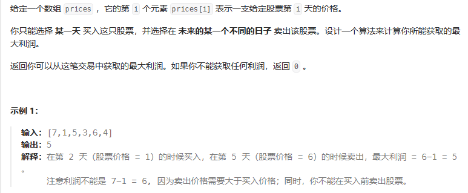

### 一次遍历：

遍历prices，每次遍历更新记录在当前price[i]及之前的最低价格，每次都将当天的股价减去之前的最低价格，找出最大的利润

```
public class Solution {
    public int maxProfit(int prices[]) {
        int minprice = Integer.MAX_VALUE;
        int maxprofit = 0;
        for (int i = 0; i < prices.length; i++) {
            if (prices[i] < minprice) {//更新最低价格
                minprice = prices[i];
            } else if (prices[i] - minprice > maxprofit) {//更新最大利润
                maxprofit = prices[i] - minprice;
            }
        }
        return maxprofit;
    }
}

```