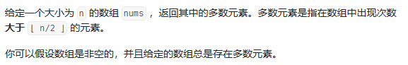

### 常规：
建立哈希表映射，求出其中最多的元素

<br>

### 进阶：
#### 分治：

如果数 a 是数组 nums 的众数，如果我们将 nums 分成两部分，那么 a 必定是至少一部分的众数。

我们可以使用反证法来证明这个结论。假设 a 既不是左半部分的众数，也不是右半部分的众数，那么 a 出现的次数少于 l / 2 + r / 2 次，其中 l 和 r 分别是左半部分和右半部分的长度。由于 l / 2 + r / 2 <= (l + r) / 2，说明 a 也不是数组 nums 的众数，因此出现了矛盾。所以这个结论是正确的。

这样以来，我们就可以使用分治法解决这个问题：将数组分成左右两部分，分别求出左半部分的众数 a1 以及右半部分的众数 a2，随后在 a1 和 a2 中选出正确的众数。


<br>

#### Boyer-Moore 投票算法：

我们维护一个候选众数 candidate 和它出现的次数 count。初始时 candidate 可以为任意值，count 为 0；

我们遍历数组 nums 中的所有元素，对于每个元素 x，在判断 x 之前，如果 count 的值为 0，我们先将 x 的值赋予 candidate，随后我们判断 x：

如果 x 与 candidate 相等，那么计数器 count 的值增加 1；

如果 x 与 candidate 不等，那么计数器 count 的值减少 1。

在遍历完成后，candidate 即为整个数组的众数
````

